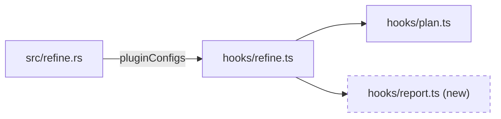
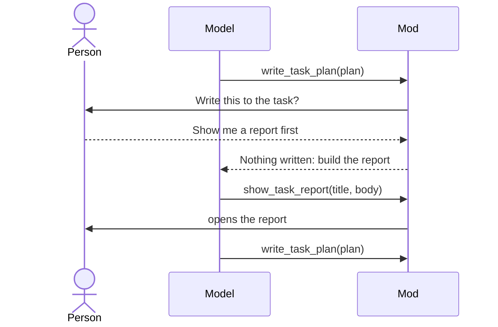
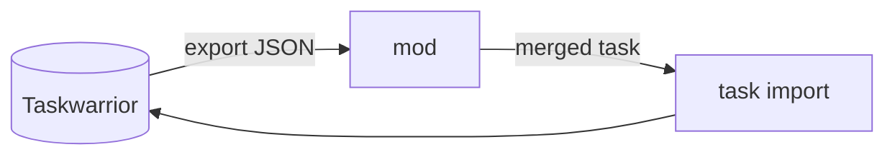
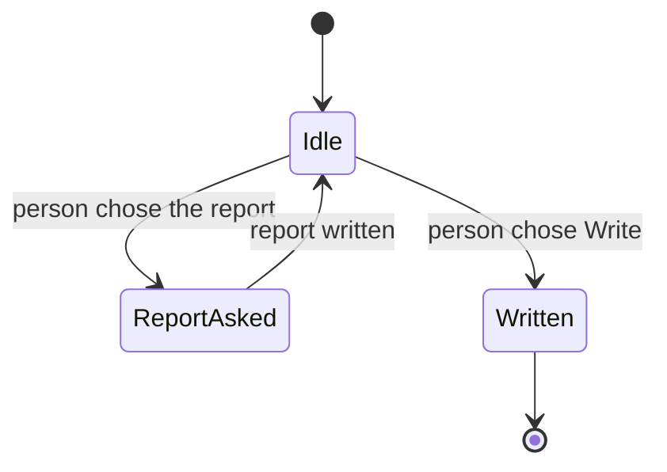
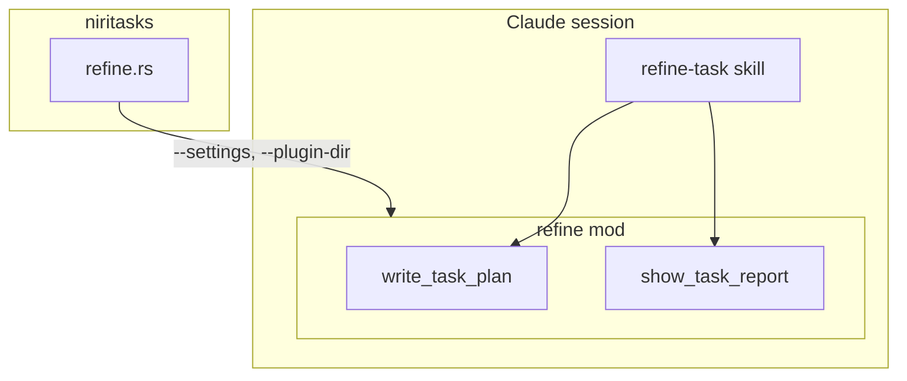
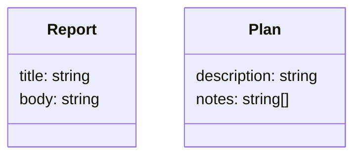

# Refine report catalogue

What a refine's HTML report holds, and the diagrams and tables that can
explain a plan, each with when it applies. Read it when the person chooses
**Show me a report first**, pick what fits the task, and pass the result to
`show_task_report` as `body`.

The report is for one decision: approve this plan, or change it. Every
section should help the person see what will change and judge whether the
plan is right. Leave out a section whose "when" does not hold; a short report
that fits is better than a long one that pads.

## The page you write

You write only what goes inside `<body>`. The tool adds the rest: the page
head, a stylesheet, and Mermaid. The page runs no script of yours and loads
nothing but Mermaid, so the tool refuses `<script>`, `<meta>`, `<link>`, `<base>`,
`<iframe>`, `<frame>`, `<frameset>`, `<object>`, `<embed>`, `<form>` and
`<portal>`. Styles in a `<style>` element are fine. Images must be inline:
`<svg>` or a `data:` URL.

Diagrams are either:

- **Mermaid** — `<pre class="mermaid">…</pre>` holding a Mermaid 11
  diagram. Escape `<` and `&` inside it as `&lt;` and `&amp;`.
  Mermaid lays it out; use it for anything with boxes and arrows. Offline it
  shows as its source text.
- **Inline SVG** — for what Mermaid draws badly: a screen mock-up, a
  before/after of a layout, a timeline with real proportions. Give it a
  `viewBox`, and use `currentColor` for lines and text so it reads in dark
  mode.

Put each diagram in a `<figure>` with a `<figcaption>` saying what to look
at.

The stylesheet gives you, beyond plain HTML:

| Class | On | What it is |
|---|---|---|
| `lede` | `<p>` | The opening summary, set larger. |
| `badge add`, `badge change`, `badge remove` | `<span>` | A coloured chip for a file's change. |
| `cols` | `<div>` | Its children side by side, stacked on a narrow window: before and after. |
| `callout` | `<div>` or `<aside>` | A boxed note: an open question, an assumption. |
| `risk high`, `risk medium`, `risk low` | `<span>` | A coloured chip for a risk's level. |
| `muted` | any | Quieter text: paths, asides. |

Tables, `<details>`, `<code>`, `<pre>`, headings and lists are styled.

## What every report holds

In this order:

1. **`<h1>`** — the task's new description.
2. **Summary** — a `<p class="lede">`: what the plan does and why, in two or
   three sentences, from the Goal note.
3. **Files to change** — the file-change map below. Always.
4. **The diagrams that fit** — from the catalogue below, each under an
   `<h2>` naming what it shows.
5. **Done when** — the done-when checks below. Always.
6. **Out of scope** — a list, when the plan has an Out of scope note.

Ground everything in the code you read: real paths, real function and type
names. Mark what the plan adds and does not yet exist as new.

## Catalogue

### File-change map

**When:** always.

A table, one row per file: the path in `<code>`, a badge for the change,
why it changes in one sentence, and which step of the plan touches it. Group
rows by area (module, folder) when there are more than about eight. When the
files call one another in ways the plan changes, follow the table with a
Mermaid flowchart of them, new files and edges marked.

```html
<table>
  <thead><tr><th>File</th><th>Change</th><th>Why</th><th>Step</th></tr></thead>
  <tbody>
    <tr><td><code>src/refine.rs</code></td><td><span class="badge change">change</span></td>
      <td>Tells the mod where reports go.</td><td>3</td></tr>
    <tr><td><code>claude/refine-mod/hooks/report.ts</code></td><td><span class="badge add">new</span></td>
      <td>Builds the page around the model's HTML.</td><td>2</td></tr>
  </tbody>
</table>
```



### Before and after

**When:** the plan changes how something behaves, looks or flows, and the
change is easier to see than to read.

Two figures in a `<div class="cols">`, the same kind of diagram on each side
so the difference stands out: two flowcharts for a flow, two inline SVG
mock-ups for a screen, two short code excerpts in `<pre>` for an interface.

```html
<div class="cols">
  <figure><pre class="mermaid">flowchart TD
  a[Ask] --> w[Write]
  a --> c[Change]</pre><figcaption>Before: two answers.</figcaption></figure>
  <figure><pre class="mermaid">flowchart TD
  a[Ask] --> w[Write]
  a --> r[Report] --> a
  a --> c[Change]</pre><figcaption>After: a report, then ask again.</figcaption></figure>
</div>
```

### Sequence

**When:** several actors — the person, a CLI, a daemon, a mod, an external
service — exchange calls or messages, and the order matters. arc42 calls this
the runtime view.



### Data flow

**When:** data moves through stages — read, transformed, stored, sent —
and the plan adds or changes a stage, a format or a store.

A Mermaid `flowchart LR`, stores as cylinders (`[( )]`), processes as boxes,
edges labelled with what moves.



### State machine

**When:** something has states and transitions the plan adds, removes or
guards: a task's status or tags, a mode, a session's lifecycle, a one-shot
flag.



### Decision table

**When:** behaviour branches on two or more inputs, and the plan sets or
changes what each combination does.

An HTML table: one column per condition, one for the outcome, one row per
combination that behaves differently. Say what happens for the combinations
left out.

```html
<table>
  <thead><tr><th>uuid valid</th><th>sandbox on</th><th>reports folder</th><th>Offered</th></tr></thead>
  <tbody>
    <tr><td>yes</td><td>yes</td><td>absolute</td><td>both tools, three answers</td></tr>
    <tr><td>yes</td><td>yes</td><td>missing</td><td>write tool, two answers</td></tr>
    <tr><td>no</td><td>any</td><td>any</td><td>no tool</td></tr>
  </tbody>
</table>
```

### Component map

**When:** the plan adds a module, process or service, or moves a
responsibility between them. A C4 container or component view: one level,
not the whole system.

A Mermaid flowchart with a `subgraph` per process or package, the new or
changed parts marked.



### Types and data shapes

**When:** the plan adds or changes a type, a JSON shape, a table or a
config's keys. A Mermaid `classDiagram` for types with methods, an
`erDiagram` for stored records, or a table of field, type and meaning for a
flat shape.



### Screen mock-up

**When:** the plan changes something the person sees: a panel, a dialog, a
card, a message. Inline SVG with boxes and text at roughly the real
proportions, or HTML and CSS boxes. Pair it with Before and after when it
replaces something.

```html
<svg viewBox="0 0 320 120" width="320" role="img" aria-label="The question with three answers">
  <rect x="1" y="1" width="318" height="118" rx="8" fill="none" stroke="currentColor"/>
  <text x="16" y="28" fill="currentColor">Write this to the task?</text>
  <text x="16" y="56" fill="currentColor">1. Write it to the task</text>
  <text x="16" y="80" fill="currentColor">2. Show me a report first</text>
  <text x="16" y="104" fill="currentColor">3. Change something</text>
</svg>
```

### Order of work

**When:** the plan has steps that depend on one another, or that land as
separate commits. An ordered list, one item per step with the files it
touches; a Mermaid flowchart when the dependencies are not a straight line.

### Options considered

**When:** a Decided note chose between alternatives. A table: option, what it
costs, what it gains, and which was chosen and why.

### Risks

**When:** the plan can break something already working, touches data the
person cannot easily restore, changes a security boundary, or rests on an
assumption not yet proven. arc42 calls these risks and technical debt.

A table: risk, a `risk high|medium|low` chip, how likely, what it would
break, and what the plan does about it.

```html
<table>
  <thead><tr><th>Risk</th><th>Level</th><th>Mitigation</th></tr></thead>
  <tbody>
    <tr><td>The report's HTML runs script in the person's browser.</td>
      <td><span class="risk high">high</span></td>
      <td>The page's CSP allows only pinned Mermaid; script elements are refused.</td></tr>
  </tbody>
</table>
```

### Open questions and assumptions

**When:** the plan rests on something not yet checked, or leaves a question
for the person. A `<div class="callout">` per item, saying what would change
if it turned out otherwise.

### Done-when checks

**When:** always.

A table from the Done when note: each check, and how it will be verified —
the test that runs, the command, or what to look for by hand.

```html
<table>
  <thead><tr><th>Check</th><th>Verified by</th></tr></thead>
  <tbody>
    <tr><td>The report opens in the browser</td><td>A live refine, by hand</td></tr>
    <tr><td>The mod's tests pass</td><td><code>claude plugin test claude/refine-mod</code></td></tr>
  </tbody>
</table>
```

## Sources

- Mermaid syntax and usage: https://mermaid.js.org/intro/
- The C4 model: https://c4model.com/
- arc42: https://docs.arc42.org/home/
- MDN, Content-Security-Policy:
  https://developer.mozilla.org/en-US/docs/Web/HTTP/Reference/Headers/Content-Security-Policy
