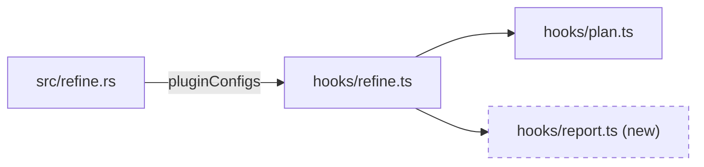
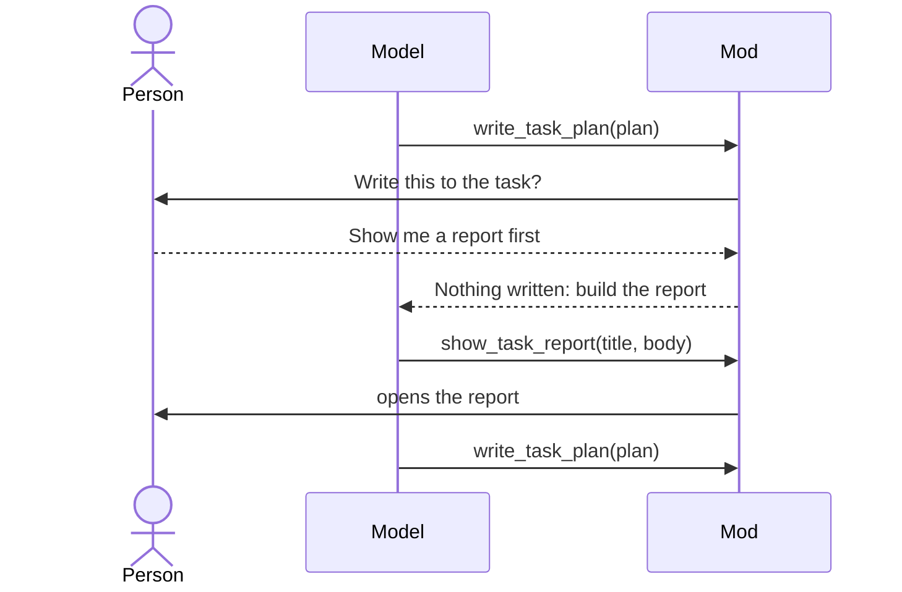
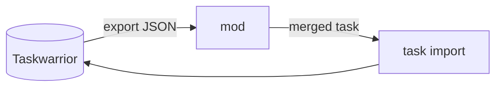
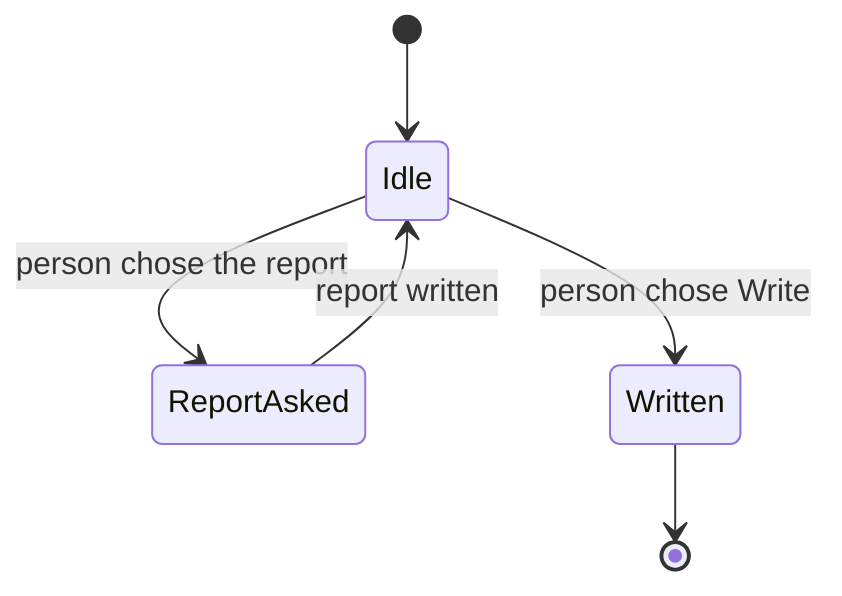
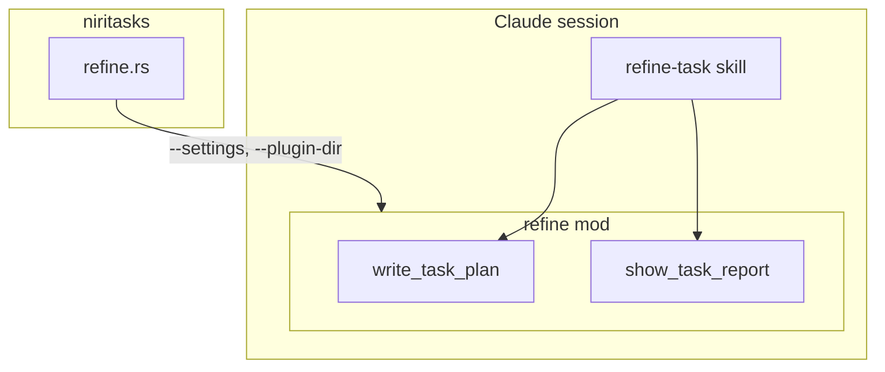
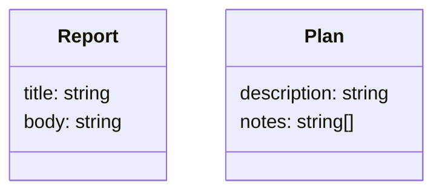

# Let a Refine Show an HTML Report of Its Plan Implementation Plan

> **For agentic workers:** REQUIRED SUB-SKILL: Use superpowers:subagent-driven-development (recommended) or superpowers:executing-plans to implement this plan task-by-task. Steps use checkbox (`- [ ]`) syntax for tracking.

**Goal:** Before approving a refine, the person can choose **Show me a report first** in the write tool's question; the session then builds an HTML report of the plan (which files change, why, and fitting diagrams), the mod writes it to `~/.local/share/niri-tasks/reviews/` and opens it in the browser, and the write tool asks again.

**Architecture:** The refine mod (`claude/refine-mod`) gains a third `$.ui.ask` option in `write_task_plan` and a second served tool, `show_task_report`. Choosing the option writes nothing, sets a one-shot flag in the module and answers the model to build the report; `show_task_report` works only while that flag is set, takes a `title` and the HTML `body`, wraps the body in a page of the mod's own (a Content-Security-Policy that allows no script but one pinned, integrity-checked Mermaid, loads nothing and sends nothing), writes it with `$.fs.write` and opens it with `xdg-open`. The reports folder reaches the mod the way the uuid does, through `pluginConfigs` in the `--settings` JSON that `src/refine.rs` builds. A catalogue of report sections and diagram types sits beside the `refine-task` skill, and the skill's step 5 says how to use it.

**Tech Stack:** TypeScript Claude Code mod (`claude plugin validate`, `claude plugin test`, Claude Code 2.1.295 here), Rust (`cargo test`), Mermaid 11.17.2 from jsDelivr, bash (`install.sh`).

**Spec:** Taskwarrior task `691724fc-d9ff-408f-b00e-a9bcc693ef18`. Read it with `task rc.json.array=on 691724fc-d9ff-408f-b00e-a9bcc693ef18 export`; its description and annotations are the spec. Background: `docs/adr/0002-refine-keeps-its-fence-mod-takes-the-write.md`.

## Global Constraints

- The report is on demand only, through the new option. Never made on every refine.
- The new option's label is exactly `Show me a report first`. Choosing it writes nothing to the task.
- The report is written by the mod (the session's sandbox writes only `~/.task`) to `<XDG data>/niri-tasks/reviews/refine-<uuid8>-<YYYYMMDD-HHMMSS>.html`, never `/tmp`. The time is UTC, so a revised plan's second report does not overwrite the first.
- The report tool is armed the same way as `write_task_plan`: a valid uuid from `pluginConfigs`, and the sandbox on with `failIfUnavailable`. It also needs an absolute `reports` folder from `pluginConfigs`; without one, neither the tool nor the option is offered.
- The report is not published anywhere off this machine. The page loads only the pinned Mermaid script.
- Mermaid is pinned to `https://cdn.jsdelivr.net/npm/mermaid@11.17.2/dist/mermaid.min.js` with integrity `sha384-EOXBFmc3gx5mb+vn0vPvvGqACToJD24hhacX5Yx+8NUUQrHIle/Qi5Bg9o3zKwW2`.
- The catalogue is `.claude/skills/refine-task/report-catalogue.md`, linked by `install.sh` beside the skill's `SKILL.md`.
- Done when: in a live refine, choosing the report option opens an HTML report in the browser listing the files to change, why, and fitting diagrams, and approving afterwards still writes the task; `claude plugin test claude/refine-mod` and `cargo test` pass.
- Out of scope: making the report on every refine; publishing it anywhere off this machine.
- Commits: Conventional Commits (`feat(refine): …`, `docs(refine): …`), subject ≤ 72 characters, each ending with `Co-Authored-By: Claude Opus 5.5 <noreply@anthropic.com>`.

## Background for the implementer

**The refine session.** `niritasks task refine <uuid>` (`src/refine.rs` `launch`) opens Claude in a herdr tab with a Bash sandbox that may write only the task data, the Edit and Write tools removed, and the mod loaded with `--plugin-dir`. The `refine-task` skill (`.claude/skills/refine-task/SKILL.md`) reads the task, drafts a plan, and calls the mod's `write_task_plan` tool. That tool logs the plan to the transcript with `$.ui.log`, asks "Write this to the task?" with `$.ui.ask`, and imports the task only on **Write it to the task**. Read ADR 0002 for why.

**The mod.** `claude/refine-mod/hooks/refine.ts` registers the tools and serves them from `tool.call` hooks; `claude/refine-mod/hooks/plan.ts` is its pure half (no `$`), unit-tested directly. Everything outside the module goes through `$`: `$.process.run(argv, { stdin })` runs a command as the user, outside the sandbox; `$.fs.write(path, text)` writes a file, creating its folders; `$.clock.now()` is the time in ms. `options` (the second argument of `register`) is what `pluginConfigs.niri-tasks-refine.options` in `--settings` set. The API's declaration file is written when the `plugin-authoring` skill loads (its path is in that skill's text) and, once the engine has loaded the mod, under `claude/refine-mod/.claude-plugin/types/` (not committed). Grep it rather than guessing.

**Tests.** `claude plugin test claude/refine-mod` runs `claude/refine-mod/tests/*.test.ts`. A test gets `($, on)`: `on(...)` adds hooks beneath the plugin that stand in for the engine (`process.run`, `fs.write`, `settings.read`, the AskUserQuestion dialog), and `$` drives the plugin. Read `claude/refine-mod/tests/refine.test.ts` before Task 4: its `engine` and `world` helpers are what you extend. `claude plugin validate claude/refine-mod` checks the manifest and what the module calls.

**Why the page's policy.** The report is HTML the model wrote, opened in the person's own browser, outside the sandbox and with their cookies. Script there could navigate or post anywhere as them. So the mod writes the page head itself, and its first element is a CSP meta: `default-src 'none'` (nothing fetched, no frames, no objects), `script-src` the one Mermaid URL (no inline script, no event handlers, no `javascript:` links), `style-src 'unsafe-inline'` (the model's `<style>` and Mermaid's own), `img-src data:` and `font-src data:`, `form-action 'none'`, `base-uri 'none'`. CSP does not govern a `<meta http-equiv="refresh">`, and a meta CSP applies only to what follows it, so the tool refuses `<meta>`, `<base>`, `<link>`, `<script>`, `<iframe>`, `<frame>`, `<frameset>`, `<object>`, `<embed>`, `<form>` and `<portal>` in the body outright, by name, so the model hears why. A headless Chrome probe on 2026-10-09 confirmed that under this policy Mermaid 11.17.2's `mermaid.min.js` renders sequence, state and flowchart diagrams (it starts itself on `load`, `startOnLoad` defaulting to true) while an inline `<script>` is refused. Offline, the Mermaid blocks show as their source text; the tables and inline SVG still read.

## File Structure

- Create `.claude/skills/refine-task/report-catalogue.md` — what every report holds, the stylesheet's classes, and the catalogue of sections and diagrams, each with when it applies and how to draw it.
- Modify `install.sh` — link the catalogue beside `SKILL.md`.
- Create `claude/refine-mod/hooks/report.ts` — the pure half of `show_task_report`: input parsing, the refused elements, the page, the file name, the open command.
- Create `claude/refine-mod/tests/report.test.ts` — unit tests for `report.ts`.
- Modify `claude/refine-mod/hooks/plan.ts` — export `HIDDEN`; add `REPORT`, `REPORT_FIRST`, `NOT_ASKED_FOR`.
- Modify `claude/refine-mod/hooks/refine.ts` — the third option, the one-shot flag, the `show_task_report` tool.
- Modify `claude/refine-mod/tests/refine.test.ts` — the option, the flag and the tool end to end.
- Modify `claude/refine-mod/.claude-plugin/plugin.json` — a `reports` user option.
- Modify `src/refine.rs` — `reports_dir`, and `reports` in `pluginConfigs`.
- Modify `.claude/skills/refine-task/SKILL.md` — steps 1, 4 and 5.

---

### Task 1: The report catalogue

The spec's first step is research: which report sections and diagram types help someone review a plan, and how others render diagrams in a standalone HTML file. The design above settles the rendering (Mermaid, pinned, under a CSP; inline SVG for anything Mermaid draws badly), and the catalogue below is drafted from these sources. Your job is to check it against them, keep what holds, and prove every Mermaid example renders.

**Files:**
- Create: `.claude/skills/refine-task/report-catalogue.md`
- Modify: `install.sh` (after the `refine-task` `SKILL.md` link, line 87)

**Interfaces:**
- Consumes: nothing.
- Produces: the catalogue file the skill (Task 5) tells the model to read; the class names `lede`, `badge add|change|remove`, `cols`, `callout`, `risk high|medium|low`, `muted` that `BASE_CSS` (Task 2) styles.

- [ ] **Step 1: Check the sources**

Open each and confirm the catalogue's use of it; fix the catalogue text where a source disagrees:
- Mermaid syntax pages: https://mermaid.js.org/syntax/flowchart.html, https://mermaid.js.org/syntax/sequenceDiagram.html, https://mermaid.js.org/syntax/stateDiagram.html, https://mermaid.js.org/syntax/classDiagram.html, https://mermaid.js.org/syntax/entityRelationshipDiagram.html, https://mermaid.js.org/config/usage.html (the `startOnLoad` and `securityLevel` defaults).
- The C4 model, for the component map: https://c4model.com/
- arc42's views (building block, runtime, deployment) and risks section: https://docs.arc42.org/home/
- MDN on CSP, for why the page's policy: https://developer.mozilla.org/en-US/docs/Web/HTTP/Reference/Headers/Content-Security-Policy

- [ ] **Step 2: Write the catalogue**

Create `.claude/skills/refine-task/report-catalogue.md` with exactly this content (adjusted only where Step 1 found a source disagreeing):

````markdown
# Refine report catalogue

What a refine's HTML report holds, and the diagrams and tables that can
explain a plan, each with when it applies. Read it when the person chooses
**Show me a report first**, pick what fits the task, and pass the result to
`show_task_report` as `body`.

The report is for one decision: approve this plan, or change it. Every
section should help the person see what will change and judge whether the
plan is right. Leave out a section whose "when" does not hold; a short report
that fits is better than a long one that pads.

## The page you write

You write only what goes inside `<body>`. The tool adds the rest: the page
head, a stylesheet, and Mermaid. The page runs no script of yours and loads
nothing, so the tool refuses `<script>`, `<meta>`, `<link>`, `<base>`,
`<iframe>`, `<frame>`, `<frameset>`, `<object>`, `<embed>`, `<form>` and
`<portal>`. Styles in a `<style>` element are fine. Images must be inline:
`<svg>` or a `data:` URL.

Diagrams are either:

- **Mermaid** — `<pre class="mermaid">…</pre>` holding a Mermaid 11
  diagram. Escape `<`, `>` and `&` inside it as `&lt;`, `&gt;`, `&amp;`.
  Mermaid lays it out; use it for anything with boxes and arrows. Offline it
  shows as its source text.
- **Inline SVG** — for what Mermaid draws badly: a screen mock-up, a
  before/after of a layout, a timeline with real proportions. Give it a
  `viewBox`, and use `currentColor` for lines and text so it reads in dark
  mode.

Put each diagram in a `<figure>` with a `<figcaption>` saying what to look
at.

The stylesheet gives you, beyond plain HTML:

| Class | On | What it is |
|---|---|---|
| `lede` | `<p>` | The opening summary, set larger. |
| `badge add`, `badge change`, `badge remove` | `<span>` | A coloured chip for a file's change. |
| `cols` | `<div>` | Its children side by side, stacked on a narrow window: before and after. |
| `callout` | `<div>` or `<aside>` | A boxed note: an open question, an assumption. |
| `risk high`, `risk medium`, `risk low` | `<span>` | A coloured chip for a risk's level. |
| `muted` | any | Quieter text: paths, asides. |

Tables, `<details>`, `<code>`, `<pre>`, headings and lists are styled.

## What every report holds

In this order:

1. **`<h1>`** — the task's new description.
2. **Summary** — a `<p class="lede">`: what the plan does and why, in two or
   three sentences, from the Goal note.
3. **Files to change** — the file-change map below. Always.
4. **The diagrams that fit** — from the catalogue below, each under an
   `<h2>` naming what it shows.
5. **Done when** — the done-when checks below. Always.
6. **Out of scope** — a list, when the plan has an Out of scope note.

Ground everything in the code you read: real paths, real function and type
names. Mark what the plan adds and does not yet exist as new.

## Catalogue

### File-change map

**When:** always.

A table, one row per file: the path in `<code>`, a badge for the change,
why it changes in one sentence, and which step of the plan touches it. Group
rows by area (module, folder) when there are more than about eight. When the
files call one another in ways the plan changes, follow the table with a
Mermaid flowchart of them, new files and edges marked.

```html
<table>
  <thead><tr><th>File</th><th>Change</th><th>Why</th><th>Step</th></tr></thead>
  <tbody>
    <tr><td><code>src/refine.rs</code></td><td><span class="badge change">change</span></td>
      <td>Tells the mod where reports go.</td><td>3</td></tr>
    <tr><td><code>claude/refine-mod/hooks/report.ts</code></td><td><span class="badge add">new</span></td>
      <td>Builds the page around the model's HTML.</td><td>2</td></tr>
  </tbody>
</table>
```



### Before and after

**When:** the plan changes how something behaves, looks or flows, and the
change is easier to see than to read.

Two figures in a `<div class="cols">`, the same kind of diagram on each side
so the difference stands out: two flowcharts for a flow, two inline SVG
mock-ups for a screen, two short code excerpts in `<pre>` for an interface.

```html
<div class="cols">
  <figure><pre class="mermaid">flowchart TD
  a[Ask] --> w[Write]
  a --> c[Change]</pre><figcaption>Before: two answers.</figcaption></figure>
  <figure><pre class="mermaid">flowchart TD
  a[Ask] --> w[Write]
  a --> r[Report] --> a
  a --> c[Change]</pre><figcaption>After: a report, then ask again.</figcaption></figure>
</div>
```

### Sequence

**When:** several actors — the person, a CLI, a daemon, a mod, an external
service — exchange calls or messages, and the order matters. arc42 calls this
the runtime view.



### Data flow

**When:** data moves through stages — read, transformed, stored, sent —
and the plan adds or changes a stage, a format or a store.

A Mermaid `flowchart LR`, stores as cylinders (`[( )]`), processes as boxes,
edges labelled with what moves.



### State machine

**When:** something has states and transitions the plan adds, removes or
guards: a task's status or tags, a mode, a session's lifecycle, a one-shot
flag.



### Decision table

**When:** behaviour branches on two or more inputs, and the plan sets or
changes what each combination does.

An HTML table: one column per condition, one for the outcome, one row per
combination that behaves differently. Say what happens for the combinations
left out.

```html
<table>
  <thead><tr><th>uuid valid</th><th>sandbox on</th><th>reports folder</th><th>Offered</th></tr></thead>
  <tbody>
    <tr><td>yes</td><td>yes</td><td>absolute</td><td>both tools, three answers</td></tr>
    <tr><td>yes</td><td>yes</td><td>missing</td><td>write tool, two answers</td></tr>
    <tr><td>no</td><td>any</td><td>any</td><td>no tool</td></tr>
  </tbody>
</table>
```

### Component map

**When:** the plan adds a module, process or service, or moves a
responsibility between them. A C4 container or component view: one level,
not the whole system.

A Mermaid flowchart with a `subgraph` per process or package, the new or
changed parts marked.



### Types and data shapes

**When:** the plan adds or changes a type, a JSON shape, a table or a
config's keys. A Mermaid `classDiagram` for types with methods, an
`erDiagram` for stored records, or a table of field, type and meaning for a
flat shape.



### Screen mock-up

**When:** the plan changes something the person sees: a panel, a dialog, a
card, a message. Inline SVG with boxes and text at roughly the real
proportions, or HTML and CSS boxes. Pair it with Before and after when it
replaces something.

```html
<svg viewBox="0 0 320 120" width="320" role="img" aria-label="The question with three answers">
  <rect x="1" y="1" width="318" height="118" rx="8" fill="none" stroke="currentColor"/>
  <text x="16" y="28" fill="currentColor">Write this to the task?</text>
  <text x="16" y="56" fill="currentColor">1. Write it to the task</text>
  <text x="16" y="80" fill="currentColor">2. Show me a report first</text>
  <text x="16" y="104" fill="currentColor">3. Change something</text>
</svg>
```

### Order of work

**When:** the plan has steps that depend on one another, or that land as
separate commits. An ordered list, one item per step with the files it
touches; a Mermaid flowchart when the dependencies are not a straight line.

### Options considered

**When:** a Decided note chose between alternatives. A table: option, what it
costs, what it gains, and which was chosen and why.

### Risks

**When:** the plan can break something already working, touches data the
person cannot easily restore, changes a security boundary, or rests on an
assumption not yet proven. arc42 calls these risks and technical debt.

A table: risk, a `risk high|medium|low` chip, how likely, what it would
break, and what the plan does about it.

```html
<table>
  <thead><tr><th>Risk</th><th>Level</th><th>Mitigation</th></tr></thead>
  <tbody>
    <tr><td>The report's HTML runs script in the person's browser.</td>
      <td><span class="risk high">high</span></td>
      <td>The page's CSP allows only pinned Mermaid; script elements are refused.</td></tr>
  </tbody>
</table>
```

### Open questions and assumptions

**When:** the plan rests on something not yet checked, or leaves a question
for the person. A `<div class="callout">` per item, saying what would change
if it turned out otherwise.

### Done-when checks

**When:** always.

A table from the Done when note: each check, and how it will be verified —
the test that runs, the command, or what to look for by hand.

```html
<table>
  <thead><tr><th>Check</th><th>Verified by</th></tr></thead>
  <tbody>
    <tr><td>The report opens in the browser</td><td>A live refine, by hand</td></tr>
    <tr><td>The mod's tests pass</td><td><code>claude plugin test claude/refine-mod</code></td></tr>
  </tbody>
</table>
```

## Sources

- Mermaid syntax and usage: https://mermaid.js.org/intro/
- The C4 model: https://c4model.com/
- arc42: https://docs.arc42.org/home/
- MDN, Content-Security-Policy:
  https://developer.mozilla.org/en-US/docs/Web/HTTP/Reference/Headers/Content-Security-Policy
````

- [ ] **Step 3: Prove every Mermaid example renders**

Build a throwaway page from the catalogue's Mermaid blocks (the ```` ```mermaid ```` fences and the `<pre class="mermaid">` blocks inside the before-and-after HTML) and render it in headless Chrome. Work in the session's scratchpad directory, not the repo:

```bash
S="$(mktemp -d)"   # or your scratchpad directory
python3 - .claude/skills/refine-task/report-catalogue.md "$S/catalogue.html" <<'EOF'
import html, re, sys
text = open(sys.argv[1]).read()
blocks = re.findall(r"```mermaid\n(.*?)```", text, re.S)
blocks += [html.unescape(b) for b in re.findall(r'<pre class="mermaid">(.*?)</pre>', text, re.S)]
url = "https://cdn.jsdelivr.net/npm/mermaid@11.17.2/dist/mermaid.min.js"
body = "".join(f'<pre class="mermaid">{html.escape(b)}</pre>' for b in blocks)
open(sys.argv[2], "w").write(f'<!doctype html><html><head><meta charset="utf-8"><script src="{url}"></script></head><body>{body}</body></html>')
print(len(blocks), "blocks")
EOF
timeout 60 google-chrome --headless=new --disable-gpu --virtual-time-budget=10000 --dump-dom "file://$S/catalogue.html" > "$S/out.html"
grep -c '<svg id="mermaid' "$S/out.html"; grep -c 'Syntax error' "$S/out.html"
```

Expected: the first count equals the number of blocks printed, and `Syntax error` counts 0. Fix any block that fails and run again.

- [ ] **Step 4: Link it from install.sh**

In `install.sh`, directly after the line `link "$REPO/.claude/skills/refine-task/SKILL.md" "$CLAUDE_SKILLS/refine-task/SKILL.md"`, add:

```bash
link "$REPO/.claude/skills/refine-task/report-catalogue.md" "$CLAUDE_SKILLS/refine-task/report-catalogue.md"
```

And change the comment above it from `# refine-task: what a card's Refine and Grill me buttons open Claude with.` to:

```bash
# refine-task: what a card's Refine and Grill me buttons open Claude with, and
# the report catalogue it reads when the person asks for a report first.
```

Run: `bash -n install.sh`
Expected: no output (the script parses).

- [ ] **Step 5: Commit**

```bash
git add .claude/skills/refine-task/report-catalogue.md install.sh
git commit -m "$(cat <<'EOF'
docs(refine): add a catalogue of report sections and diagrams

What a refine's HTML report holds and every diagram or table that can
explain a plan, each with when it applies, so the session picks the
ones that fit. Linked beside the refine-task skill by install.sh.

Co-Authored-By: Claude Opus 5.5 <noreply@anthropic.com>
EOF
)"
```

---

### Task 2: The report page, pure

**Files:**
- Create: `claude/refine-mod/hooks/report.ts`
- Modify: `claude/refine-mod/hooks/plan.ts` (`const HIDDEN` → `export const HIDDEN`)
- Test: `claude/refine-mod/tests/report.test.ts`

**Interfaces:**
- Consumes: `HIDDEN: RegExp` from `./plan`.
- Produces (all exported from `hooks/report.ts`):
  - `type Report = { title: string; body: string }`
  - `MERMAID_URL: string`, `MERMAID_SRI: string`, `CSP: string`, `MAX_TITLE = 120`, `MAX_BODY = 1_000_000`
  - `parseReport(e: Record<string, unknown>): Report | string` — the report, or what is wrong with it
  - `reportPage(report: Report): string` — the whole HTML document
  - `reportsDir(value: unknown): string | undefined` — an absolute folder without a trailing slash, or undefined
  - `reportPath(dir: string, uuid: string, nowMs: number): string` — `<dir>/refine-<uuid8>-<YYYYMMDD-HHMMSS>.html`, UTC
  - `openArgv(path: string): string[]` — the command that opens it in the browser, detached

- [ ] **Step 1: Write the failing tests**

Create `claude/refine-mod/tests/report.test.ts`:

```ts
import { describe, expect, test } from 'claude-code/testing'
import {
  CSP,
  MAX_BODY,
  MAX_TITLE,
  MERMAID_SRI,
  MERMAID_URL,
  openArgv,
  parseReport,
  reportPage,
  reportPath,
  reportsDir,
} from '../hooks/report'

const UUID = '0b8f6a52-3c4d-4e5f-8a9b-0c1d2e3f4a5b'

describe('parseReport', () => {
  test('takes a title and a body', () => {
    expect(parseReport({ title: 'feat: A plan', body: '<h1>A plan</h1>' })).toEqual({
      title: 'feat: A plan',
      body: '<h1>A plan</h1>',
    })
  })

  test('refuses a missing, empty, multi-line, hidden or long title', () => {
    expect(parseReport({ body: '<p>x</p>' })).toBe('title must be a non-empty string')
    expect(parseReport({ title: ' ', body: '<p>x</p>' })).toBe('title must be a non-empty string')
    expect(parseReport({ title: 'a\nb', body: '<p>x</p>' })).toBe('title must be one line')
    expect(parseReport({ title: 'a‮b', body: '<p>x</p>' })).toBe(
      'title must be plain text: no control or invisible characters',
    )
    expect(parseReport({ title: 'x'.repeat(MAX_TITLE + 1), body: '<p>x</p>' })).toBe(
      `title must be at most ${MAX_TITLE} characters`,
    )
  })

  test('refuses a missing, empty or overlong body', () => {
    expect(parseReport({ title: 't' })).toBe('body must be a non-empty string')
    expect(parseReport({ title: 't', body: '  ' })).toBe('body must be a non-empty string')
    expect(parseReport({ title: 't', body: 'x'.repeat(MAX_BODY + 1) })).toBe(
      `body must be at most ${MAX_BODY} characters`,
    )
  })

  test('refuses every element the page must not hold, by name, any case or spacing', () => {
    const tags = ['script', 'meta', 'base', 'link', 'iframe', 'frame', 'frameset', 'object', 'embed', 'form', 'portal']
    for (const tag of tags) {
      expect(parseReport({ title: 't', body: `<p>x</p><${tag} a="b">` })).toBe(
        `body must not contain <${tag}>: the page runs no script but Mermaid, loads nothing and sends nothing`,
      )
    }
    expect(parseReport({ title: 't', body: '<svg>< SCRIPT>x</script></svg>' })).toContain('<script>')
    expect(parseReport({ title: 't', body: '<META http-equiv="refresh">' })).toContain('<meta>')
  })

  test('keeps words that only begin like a refused element', () => {
    for (const body of ['<p>a <code>&lt;script&gt;</code></p>', '<formula>x</formula>', '<p>metadata</p>', '<baseline/>']) {
      expect(parseReport({ title: 't', body })).toEqual({ title: 't', body })
    }
  })
})

describe('reportPage', () => {
  const page = reportPage({ title: 'feat: <A> & "B"', body: '<pre class="mermaid">flowchart LR\n a --> b</pre>' })

  test('is a whole document with the body verbatim', () => {
    expect(page.startsWith('<!doctype html>\n')).toBe(true)
    expect(page).toContain('<pre class="mermaid">flowchart LR\n a --> b</pre>')
    expect(page.trimEnd().endsWith('</html>')).toBe(true)
  })

  test('puts the policy first in the head, before anything it governs', () => {
    const csp = page.indexOf(`<meta http-equiv="Content-Security-Policy" content="${CSP}">`)
    expect(csp).toBeGreaterThan(-1)
    expect(csp).toBeLessThan(page.indexOf('<title>'))
    expect(csp).toBeLessThan(page.indexOf('<style>'))
    expect(csp).toBeLessThan(page.indexOf('<script'))
    expect(csp).toBeLessThan(page.indexOf('<body>'))
  })

  test('allows no script but pinned Mermaid, and nothing fetched or sent', () => {
    expect(CSP).toBe(
      `default-src 'none'; script-src ${MERMAID_URL}; style-src 'unsafe-inline'; ` +
        "img-src data:; font-src data:; form-action 'none'; base-uri 'none'",
    )
    expect(MERMAID_URL).toBe('https://cdn.jsdelivr.net/npm/mermaid@11.17.2/dist/mermaid.min.js')
    expect(page).toContain(
      `<script src="${MERMAID_URL}" integrity="${MERMAID_SRI}" crossorigin="anonymous"></script>`,
    )
  })

  test('escapes the title', () => {
    expect(page).toContain('<title>feat: &lt;A&gt; &amp; &quot;B&quot;</title>')
  })
})

describe('reportsDir', () => {
  test('takes an absolute folder, without a trailing slash', () => {
    expect(reportsDir('/home/x/.local/share/niri-tasks/reviews')).toBe('/home/x/.local/share/niri-tasks/reviews')
    expect(reportsDir('/r/')).toBe('/r')
  })
  test('refuses the rest', () => {
    for (const value of [undefined, '', 'reviews', '~/reviews', '/', 7]) expect(reportsDir(value)).toBeUndefined()
  })
})

test('reportPath names the task and the UTC time', () => {
  expect(reportPath('/r', UUID, Date.UTC(2026, 9, 6, 1, 2, 3, 456))).toBe('/r/refine-0b8f6a52-20261006-010203.html')
  expect(reportPath('/r', UUID.toUpperCase(), 0)).toBe('/r/refine-0b8f6a52-19700101-000000.html')
})

test('openArgv passes the path as an argument, never as script', () => {
  const path = '/r/it\'s "here" $(x).html'
  const argv = openArgv(path)
  expect(argv).toEqual(['sh', '-c', 'xdg-open "$1" >/dev/null 2>&1 </dev/null &', 'sh', path])
})
```

- [ ] **Step 2: Run them to verify they fail**

Run: `claude plugin test claude/refine-mod`
Expected: `report.test.ts` fails to load: `../hooks/report` does not exist. The existing `plan.test.ts` and `refine.test.ts` still pass.

- [ ] **Step 3: Export HIDDEN from plan.ts**

In `claude/refine-mod/hooks/plan.ts`, change

```ts
const HIDDEN = /[\p{Cc}\p{Cf}\p{Zl}\p{Zp}\p{Cs}]/u
```

to

```ts
// Control and invisible characters, which could make text shown to the
// person look unlike what is written.
export const HIDDEN = /[\p{Cc}\p{Cf}\p{Zl}\p{Zp}\p{Cs}]/u
```

- [ ] **Step 4: Write report.ts**

Create `claude/refine-mod/hooks/report.ts`:

```ts
// The pure half of show_task_report: what it takes from the model, and the
// page it writes around it. No `$`, so the unit tests reach it directly.

import { HIDDEN } from './plan'

export type Report = { title: string; body: string }

// Mermaid's own bundle, pinned and checked: it renders every
// `<pre class="mermaid">` on load, so the page needs no script of its own.
export const MERMAID_URL = 'https://cdn.jsdelivr.net/npm/mermaid@11.17.2/dist/mermaid.min.js'
export const MERMAID_SRI = 'sha384-EOXBFmc3gx5mb+vn0vPvvGqACToJD24hhacX5Yx+8NUUQrHIle/Qi5Bg9o3zKwW2'

// The page is the model's HTML in the person's own browser, outside the
// sandbox: it runs no script but Mermaid, fetches nothing, and sends nothing.
export const CSP = [
  "default-src 'none'",
  `script-src ${MERMAID_URL}`,
  "style-src 'unsafe-inline'",
  'img-src data:',
  'font-src data:',
  "form-action 'none'",
  "base-uri 'none'",
].join('; ')

export const MAX_TITLE = 120
export const MAX_BODY = 1_000_000

// Elements refused by name: a <meta> refresh navigates and a <meta> policy
// could be added to, which the page's own policy does not stop; the rest would
// reach outside or run script, and fail quietly under it. Refused so the model
// hears why rather than finding a blank figure.
const FORBIDDEN = /<\s*(script|meta|base|link|iframe|frameset|frame|object|embed|form|portal)(?![\w-])/i

// Answers the report, or a string saying what is wrong with it.
export const parseReport = (e: Record<string, unknown>): Report | string => {
  const { title, body } = e
  if (typeof title !== 'string' || title.trim() === '') return 'title must be a non-empty string'
  if (/[\r\n]/.test(title)) return 'title must be one line'
  if (HIDDEN.test(title)) return 'title must be plain text: no control or invisible characters'
  if (title.length > MAX_TITLE) return `title must be at most ${MAX_TITLE} characters`
  if (typeof body !== 'string' || body.trim() === '') return 'body must be a non-empty string'
  if (body.length > MAX_BODY) return `body must be at most ${MAX_BODY} characters`
  const tag = FORBIDDEN.exec(body)?.[1]?.toLowerCase()
  if (tag !== undefined) {
    return `body must not contain <${tag}>: the page runs no script but Mermaid, loads nothing and sends nothing`
  }
  return { title, body }
}

const escapeHtml = (text: string): string =>
  text.replace(/&/g, '&amp;').replace(/</g, '&lt;').replace(/>/g, '&gt;').replace(/"/g, '&quot;')

// Light and dark from the system; the classes the report catalogue names.
// Mermaid draws its default (light) theme, so its figures sit on a light card.
const BASE_CSS = `
:root { color-scheme: light dark; --bg: #fafaf9; --fg: #1c1917; --muted: #57534e; --line: #d6d3d1;
  --card: #ffffff; --code: #f5f5f4; --add: #15803d; --change: #b45309; --remove: #b91c1c; --note: #1d4ed8; }
@media (prefers-color-scheme: dark) {
  :root { --bg: #1c1917; --fg: #f5f5f4; --muted: #a8a29e; --line: #44403c;
    --card: #292524; --code: #292524; --add: #4ade80; --change: #fbbf24; --remove: #f87171; --note: #93c5fd; }
}
* { box-sizing: border-box; }
body { margin: 0; background: var(--bg); color: var(--fg);
  font: 16px/1.55 system-ui, -apple-system, "Segoe UI", sans-serif; }
main { max-width: 64rem; margin: 0 auto; padding: 2rem 1rem 4rem; }
h1 { font-size: 1.8rem; line-height: 1.25; margin: 0 0 1rem; }
h2 { font-size: 1.3rem; margin: 2.5rem 0 0.75rem; padding-bottom: 0.25rem; border-bottom: 1px solid var(--line); }
h3 { font-size: 1.05rem; margin: 1.5rem 0 0.5rem; }
.lede { font-size: 1.15rem; }
.muted { color: var(--muted); }
code, pre { font-family: ui-monospace, "SF Mono", Menlo, monospace; font-size: 0.9em; }
code { background: var(--code); padding: 0.1em 0.3em; border-radius: 4px; }
pre { background: var(--code); padding: 0.75rem 1rem; border-radius: 8px; overflow-x: auto; }
table { width: 100%; border-collapse: collapse; margin: 0.75rem 0; display: block; overflow-x: auto; }
th, td { text-align: left; vertical-align: top; padding: 0.4rem 0.75rem 0.4rem 0; border-top: 1px solid var(--line); }
th { color: var(--muted); font-weight: 600; border-top: 0; }
figure { margin: 1rem 0; }
figcaption { color: var(--muted); font-size: 0.9rem; margin-top: 0.4rem; }
pre.mermaid { background: #ffffff; color: #1c1917; border: 1px solid var(--line); text-align: center; }
svg { max-width: 100%; height: auto; }
.cols { display: grid; grid-template-columns: repeat(auto-fit, minmax(18rem, 1fr)); gap: 1rem; }
.callout { border-left: 4px solid var(--note); background: var(--card); padding: 0.75rem 1rem; margin: 1rem 0; border-radius: 0 8px 8px 0; }
.badge, .risk { display: inline-block; font-size: 0.8rem; font-weight: 600; padding: 0.05rem 0.5rem;
  border-radius: 999px; border: 1px solid currentColor; white-space: nowrap; }
.badge.add, .risk.low { color: var(--add); }
.badge.change, .risk.medium { color: var(--change); }
.badge.remove, .risk.high { color: var(--remove); }
details { margin: 0.75rem 0; }
summary { cursor: pointer; font-weight: 600; }
`

// The whole page: the policy before anything it governs, then the title,
// the stylesheet and Mermaid, then the model's body as given.
export const reportPage = (report: Report): string =>
  [
    '<!doctype html>',
    '<html lang="en">',
    '<head>',
    `<meta http-equiv="Content-Security-Policy" content="${CSP}">`,
    '<meta charset="utf-8">',
    '<meta name="viewport" content="width=device-width, initial-scale=1">',
    `<title>${escapeHtml(report.title)}</title>`,
    `<style>${BASE_CSS}</style>`,
    `<script src="${MERMAID_URL}" integrity="${MERMAID_SRI}" crossorigin="anonymous"></script>`,
    '</head>',
    '<body>',
    '<main>',
    report.body,
    '</main>',
    '</body>',
    '</html>',
    '',
  ].join('\n')

// The folder the reports go in, from the session's settings: absolute, or
// none, and then the tool is not offered.
export const reportsDir = (value: unknown): string | undefined => {
  if (typeof value !== 'string' || !value.startsWith('/')) return undefined
  const dir = value.replace(/\/+$/, '')
  return dir === '' ? undefined : dir
}

// <dir>/refine-<uuid8>-<YYYYMMDD-HHMMSS>.html in UTC: a second report on the
// same task, after a revision, does not overwrite the first.
export const reportPath = (dir: string, uuid: string, nowMs: number): string => {
  const stamp = new Date(nowMs).toISOString().slice(0, 19).replace(/-|:/g, '').replace('T', '-')
  return `${dir}/refine-${uuid.slice(0, 8).toLowerCase()}-${stamp}.html`
}

// xdg-open in the background with its streams closed: a browser it starts
// would otherwise hold `$.process.run` until its timeout. The path is `$1`,
// an argument, never part of the script.
export const openArgv = (path: string): string[] => [
  'sh',
  '-c',
  'xdg-open "$1" >/dev/null 2>&1 </dev/null &',
  'sh',
  path,
]
```

Note `frameset` comes before `frame` in the alternation, and `(?![\w-])` (not `\b`) ends the name, so `<frameset` reports `frameset` and `<formula>` / `<baseline/>` / `<meta-x>` are not refused.

Note the CSP meta comes before `<meta charset>`: the charset still applies (it is within the first 1024 bytes), and nothing the policy governs comes ahead of it.

- [ ] **Step 5: Run the tests to verify they pass**

Run: `claude plugin test claude/refine-mod`
Expected: all of `plan.test.ts`, `refine.test.ts` and `report.test.ts` pass.

- [ ] **Step 6: Check the page in a browser engine**

Prove in headless Chrome that the policy and the integrity hash in `report.ts` hold together: Mermaid renders (a wrong hash or URL refuses it) and an inline script does not run. The head below is `reportPage`'s, copied from `report.ts`; if you changed `CSP`, `MERMAID_URL` or `MERMAID_SRI`, copy yours.

```bash
S="$(mktemp -d)"
U='https://cdn.jsdelivr.net/npm/mermaid@11.17.2/dist/mermaid.min.js'
cat > "$S/page.html" <<EOF
<!doctype html>
<html lang="en">
<head>
<meta http-equiv="Content-Security-Policy" content="default-src 'none'; script-src $U; style-src 'unsafe-inline'; img-src data:; font-src data:; form-action 'none'; base-uri 'none'">
<meta charset="utf-8">
<title>NOT RUN</title>
<script src="$U" integrity="sha384-EOXBFmc3gx5mb+vn0vPvvGqACToJD24hhacX5Yx+8NUUQrHIle/Qi5Bg9o3zKwW2" crossorigin="anonymous"></script>
</head>
<body><main>
<pre class="mermaid">flowchart LR
 a --> b</pre>
<script>document.title = 'RAN'</script>
</main></body>
</html>
EOF
timeout 60 google-chrome --headless=new --disable-gpu --virtual-time-budget=8000 --dump-dom "file://$S/page.html" > "$S/out.html"
grep -c '<svg id="mermaid' "$S/out.html"; grep -o '<title>[^<]*' "$S/out.html"
rm -r "$S"
```

Expected: `1`, then `<title>NOT RUN`.

- [ ] **Step 7: Validate and commit**

Run: `claude plugin validate claude/refine-mod`
Expected: no errors.

```bash
git add claude/refine-mod/hooks/report.ts claude/refine-mod/hooks/plan.ts claude/refine-mod/tests/report.test.ts
git commit -m "$(cat <<'EOF'
feat(refine): build a report page that runs none of the model's script

The page a refine report is written as: the model's body inside a head
of the mod's own, whose policy allows only pinned, integrity-checked
Mermaid and fetches and sends nothing, since the page opens in the
person's browser outside the sandbox.

Co-Authored-By: Claude Opus 5.5 <noreply@anthropic.com>
EOF
)"
```

---

### Task 3: Tell the mod where reports go

**Files:**
- Modify: `src/refine.rs` (`refine_mod_dir` at line 76, `session_settings` at line 100, `launch` at line 248, tests at lines 345, 363, 381)
- Modify: `claude/refine-mod/.claude-plugin/plugin.json`

**Interfaces:**
- Consumes: `Dirs::data()` (`src/dirs.rs:61`).
- Produces: `pub fn reports_dir(dirs: &Dirs) -> PathBuf`; `session_settings(project, task_data, hidden, uuid, reports: &Path)`; `pluginConfigs.niri-tasks-refine.options.reports`, the string the mod reads as `options.reports` in Task 4.

- [ ] **Step 1: Write the failing test**

In `src/refine.rs`'s tests, replace `the_mod_is_told_which_task_it_may_write` with:

```rust
    /// The task the mod may write, and where it may write a report, come from
    /// these settings, never from the model.
    #[test]
    fn the_mod_is_told_which_task_it_may_write_and_where_reports_go() {
        let u = "d9f76b94-e0ff-44df-85b4-060be4219169";
        let json = session_settings(Path::new("/p"), Path::new("/t"), &[], u, Path::new("/home/x/.local/share/niri-tasks/reviews"));
        let v: Value = serde_json::from_str(&json).unwrap();
        let options = &v["pluginConfigs"][REFINE_MOD]["options"];
        assert_eq!(options["uuid"], u);
        assert_eq!(options["reports"], "/home/x/.local/share/niri-tasks/reviews");
        assert_eq!(REFINE_MOD, "niri-tasks-refine", "the name in claude/refine-mod's plugin.json");
    }

    /// Reports go beside the other reviews, under the XDG data folder: the
    /// session's sandbox cannot write there, so only the mod can.
    #[test]
    fn reports_go_in_the_reviews_folder() {
        let dirs = Dirs::at(Path::new("/home/x"));
        assert_eq!(reports_dir(&dirs), PathBuf::from("/home/x/.local/share/niri-tasks/reviews"));
        assert_eq!(
            reports_dir(&dirs.with_data(Path::new("/data"))),
            PathBuf::from("/data/niri-tasks/reviews")
        );
    }
```

`Dirs::at` and `with_data` are what `the_mod_lives_under_the_xdg_data_folder` (just below) uses. In the two other tests that call `session_settings` (lines 345 and 363), add a fifth argument `Path::new("/r")`.

- [ ] **Step 2: Run it to verify it fails**

Run: `cargo test --lib refine::`
Expected: compile error: `session_settings` takes 4 arguments, and `reports_dir` is not found.

- [ ] **Step 3: Implement**

In `src/refine.rs`, after `refine_mod_dir`:

```rust
/// Where a refine's HTML report is written: beside the other reviews, under
/// the XDG data folder. Outside the session's sandbox, so only the mod writes
/// there.
pub fn reports_dir(dirs: &Dirs) -> PathBuf {
    dirs.data().join("niri-tasks/reviews")
}
```

Change `session_settings`'s signature and its `pluginConfigs`:

```rust
pub fn session_settings(project: &Path, task_data: &Path, hidden: &[PathBuf], uuid: &str, reports: &Path) -> String {
```

```rust
        "pluginConfigs": {
            (REFINE_MOD): { "options": { "uuid": uuid, "reports": reports } },
        },
```

and add to its doc comment, after the line ending `which task it may write: \`uuid\`, never anything the model says.`:

```rust
/// It is told `reports` too, the folder its report tool writes to.
```

In `launch`, change the `session_settings` call to:

```rust
    let settings = session_settings(session.dir(), &task::data_location()?, &hidden, &t.uuid, &reports_dir(&dirs));
```

- [ ] **Step 4: Add the option to plugin.json**

In `claude/refine-mod/.claude-plugin/plugin.json`, change `description` to `"Gives a refine session two tools: write_task_plan, which rewrites one Taskwarrior task's description and notes, and show_task_report, which writes and opens an HTML report of the plan when the person asks for one."`, and add to `userConfig` after `uuid`:

```json
    "reports": {
      "type": "string",
      "title": "Reports folder",
      "description": "The absolute folder show_task_report writes its HTML reports to. Unset, the report is not offered.",
      "required": false,
      "default": ""
    }
```

- [ ] **Step 5: Run the tests to verify they pass**

Run: `cargo test` then `claude plugin validate claude/refine-mod`
Expected: all Rust tests pass; validate reports no errors.

- [ ] **Step 6: Commit**

```bash
git add src/refine.rs claude/refine-mod/.claude-plugin/plugin.json
git commit -m "$(cat <<'EOF'
feat(refine): tell the refine mod where reports go

The reviews folder under the XDG data folder reaches the mod through
pluginConfigs, as the task's uuid does, so the report tool writes only
there and the XDG rule lives in one place.

Co-Authored-By: Claude Opus 5.5 <noreply@anthropic.com>
EOF
)"
```

---

### Task 4: The report option and the report tool

**Files:**
- Modify: `claude/refine-mod/hooks/plan.ts` (the approval constants, near `QUESTION`)
- Modify: `claude/refine-mod/hooks/refine.ts`
- Test: `claude/refine-mod/tests/refine.test.ts`

**Interfaces:**
- Consumes: from `./report`: `parseReport`, `reportPage`, `reportPath`, `reportsDir`, `openArgv`; `options.reports` from Task 3.
- Produces: the tool `mcp__niri-tasks-refine__show_task_report` with input `{ title: string, body: string }`; in `plan.ts`: `REPORT = 'Show me a report first'`, `REPORT_FIRST: string`, `NOT_ASKED_FOR: string`. The skill (Task 5) quotes the answers' openings: `Nothing written: the person chose "Show me a report first"`, `Wrote the report to `, `show_task_report: `.

- [ ] **Step 1: Write the failing tests**

In `claude/refine-mod/tests/refine.test.ts`:

1. Add constants under `const WRITE = 'Write it to the task'`:

```ts
const REPORT = 'Show me a report first'
const REPORT_TOOL = 'mcp__niri-tasks-refine__show_task_report'
const REPORTS = { uuid: UUID, reports: '/r' }
const REPORT_PATH = '/r/refine-0b8f6a52-20261006-010203.html'
const BODY = '<h1>feat: New words</h1><pre class="mermaid">flowchart LR\n a --> b</pre>'
```

2. Let `engine` take one answer or a list of them, one per question in order (the last repeated), and record `fs.write`. Replace the `Answer` type comment block and `engine` with:

```ts
// How the person answers the question: the label chosen or the words typed
// under Other, or `{ deny }` for a dialog no one answered. A list answers
// one question each, in order, the last one after that.
type Answer = string | { deny: string }
type Answers = Answer | readonly Answer[]

type Write = { path: string; text: string }
```

```ts
// `writeFails`, when given, is what `$.fs.write` is refused with.
const engine = (on: On, settings: Record<string, unknown>, answer: Answers = WRITE, writeFails?: string) => {
  const registered: string[] = []
  const seen: string[] = []
  const writes: Write[] = []
  let asked = 0
  on('session.start', ($, e) => ({ cwd: e.cwd }))
  on('tool.register', ($, e) => {
    const tool = `mcp__niri-tasks-refine__${e.name}`
    registered.push(tool)
    return { value: { tool } }
  })
  on('settings.read', () => ({ value: settings }))
  on('ui.log', ($, e) => {
    seen.push(`log: ${e.text}`)
    return { value: undefined }
  })
  on('fs.write', ($, e) => {
    if (writeFails !== undefined) return { deny: writeFails }
    writes.push({ path: e.path, text: e.text })
    return { value: undefined }
  })
  // `$.ui.ask` is a tool.call of AskUserQuestion; the dialog's answer is
  // `answers`, keyed by the question.
  on('tool.call', { tool: 'AskUserQuestion' }, ($, e) => {
    const [question] = e.questions
    seen.push(`ask: ${question?.question} [${question?.options.map(o => o.label).join(' | ')}] (${question?.header})`)
    const list: readonly Answer[] = Array.isArray(answer) ? answer : [answer as Answer]
    const given = list[Math.min(asked++, list.length - 1)] ?? WRITE
    if (typeof given !== 'string') return given
    return { result: { questions: e.questions, answers: { [question?.question ?? '']: given } } }
  })
  mock.clock(on, { now: Date.UTC(2026, 9, 6, 1, 2, 3) })
  return { registered, seen, writes }
}
```

and `world` to pass `writes` through:

```ts
const world = (
  on: On,
  settings: Record<string, unknown>,
  answer: Answers = WRITE,
  exports: readonly object[] = [TASK],
) => {
  const { registered, seen, writes } = engine(on, settings, answer)
  const runs: Run[] = []
  let exported = 0
  on('process.run', ($, e) => {
    runs.push(e)
    if (!e.argv.includes('export')) return ran('')
    const task = exports[Math.min(exported++, exports.length - 1)]
    return ran(JSON.stringify([task]))
  })
  return { registered, runs, seen, writes }
}
```

If the `fs.write` hook's `e` is typed differently from `{ path, text }` in the declaration file (grep `'fs.write'`), follow the declaration.

3. Append these tests at the end of the file:

```ts
test('with a reports folder: both tools, and the report among the answers', { options: REPORTS }, async ($, on) => {
  const { registered, seen } = world(on, SANDBOX)
  await $.session.start(START)
  expect(registered).toEqual([TOOL, REPORT_TOOL])
  await $.tool.call(CALL)
  expect(seen.at(-1)).toBe(`ask: Write this to the task? [${WRITE} | ${REPORT} | Change something] (Task plan)`)
})

test('a relative reports folder: no report tool, two answers', { options: { uuid: UUID, reports: 'r' } }, async ($, on) => {
  const { registered, seen } = world(on, SANDBOX)
  await $.session.start(START)
  expect(registered).toEqual([TOOL])
  await $.tool.call(CALL)
  expect(seen.at(-1)).toBe(`ask: Write this to the task? [${WRITE} | Change something] (Task plan)`)
})

test('"Show me a report first": writes nothing, the model is told to build it', { options: REPORTS }, async ($, on) => {
  const { runs, writes } = world(on, SANDBOX, REPORT)
  await $.session.start(START)
  const answer = await $.tool.call(CALL)
  expect(answer.deny).toBe(
    'Nothing written: the person chose "Show me a report first". Build the HTML report of this plan ' +
      'as the refine-task skill\'s "Report, when asked" says, show it with show_task_report, ' +
      'then call write_task_plan again with the same plan.',
  )
  expect(verbs(runs)).toEqual(['export'])
  expect(writes).toEqual([])
})

test('a report no one asked for is refused', { options: REPORTS }, async ($, on) => {
  const { runs, writes } = world(on, SANDBOX)
  await $.session.start(START)
  const answer = await $.tool.call({ tool: REPORT_TOOL, title: 'feat: New words', body: BODY })
  expect(answer.deny).toBe(
    'show_task_report: the person has not asked for a report. Call write_task_plan; ' +
      'they can choose "Show me a report first" there.',
  )
  expect(writes).toEqual([])
  expect(runs).toEqual([])
})

test('report, then approve: writes the page, opens it, then writes the task', { options: REPORTS }, async ($, on) => {
  const { runs, seen, writes } = world(on, SANDBOX, [REPORT, WRITE])
  await $.session.start(START)

  expect((await $.tool.call(CALL)).deny).toContain(`the person chose "${REPORT}"`)

  const shown = await $.tool.call({ tool: REPORT_TOOL, title: 'feat: New words', body: BODY })
  expect(shown.deny).toBeUndefined()
  expect(shown.result).toBe(
    `Wrote the report to ${REPORT_PATH} and opened it in the browser. ` +
      'Now call write_task_plan again with the same plan; the person approves or changes it there.',
  )
  expect(writes.map(w => w.path)).toEqual([REPORT_PATH])
  expect(writes[0]?.text).toContain(BODY)
  expect(writes[0]?.text).toContain('Content-Security-Policy')
  expect(seen).toContain(`log: Report: ${REPORT_PATH}`)
  expect(runs.at(-1)?.argv).toEqual(['sh', '-c', 'xdg-open "$1" >/dev/null 2>&1 </dev/null &', 'sh', REPORT_PATH])

  // One report per ask: a second needs the person to choose it again.
  const again = await $.tool.call({ tool: REPORT_TOOL, title: 'feat: New words', body: BODY })
  expect(again.deny).toStartWith('show_task_report: the person has not asked for a report.')

  const written = await $.tool.call(CALL)
  expect(written.result).toContain(`Wrote the plan to task ${UUID}`)
  expect(verbs(runs).at(-1)).toBe('import')
})

test('a body with a script is refused, and the person may still get a report', { options: REPORTS }, async ($, on) => {
  const { writes } = world(on, SANDBOX, REPORT)
  await $.session.start(START)
  await $.tool.call(CALL)
  const refused = await $.tool.call({ tool: REPORT_TOOL, title: 't', body: '<script>alert(1)</script>' })
  expect(refused.deny).toBe(
    'show_task_report: body must not contain <script>: the page runs no script but Mermaid, loads nothing and sends nothing',
  )
  expect(writes).toEqual([])
  const fixed = await $.tool.call({ tool: REPORT_TOOL, title: 't', body: BODY })
  expect(fixed.result).toContain(`Wrote the report to ${REPORT_PATH}`)
})

test('a report that cannot be written is denied by its .catch', { options: REPORTS }, async ($, on) => {
  engine(on, SANDBOX, REPORT, 'disk full')
  on('process.run', ($, e) => (e.argv.includes('export') ? ran(JSON.stringify([TASK])) : ran('')))
  await $.session.start(START)
  await $.tool.call(CALL)
  const answer = await $.tool.call({ tool: REPORT_TOOL, title: 't', body: BODY })
  expect(answer.deny).toBe('niri-tasks-refine: show_task_report failed.')
})

test('sandbox off: no report tool either', { options: REPORTS }, async ($, on) => {
  const { registered } = world(on, { sandbox: { enabled: true, failIfUnavailable: false } })
  await $.session.start(START)
  expect(registered).toEqual([])
})
```

A `{ deny }` from a `$` call's stand-in makes that call reject, as `a hook that throws is denied by its .catch` already relies on for `process.run`.

- [ ] **Step 2: Run them to verify they fail**

Run: `claude plugin test claude/refine-mod`
Expected: six new tests fail (only `write_task_plan` is registered; the question has two answers). `a relative reports folder` and `sandbox off: no report tool either` already pass: they guard what must not change. Every older test still passes.

- [ ] **Step 3: Add the answers to plan.ts**

In `claude/refine-mod/hooks/plan.ts`, after `export const HEADER = 'Task plan'`, add:

```ts
// The third answer, offered when the session has a reports folder: write
// nothing yet, show the person a report of the plan first.
export const REPORT = 'Show me a report first'

// What the model reads when the person chose REPORT.
export const REPORT_FIRST =
  `Nothing written: the person chose "${REPORT}". Build the HTML report of this plan ` +
  'as the refine-task skill\'s "Report, when asked" says, show it with show_task_report, ' +
  'then call write_task_plan again with the same plan.'

// What the model reads when it calls show_task_report unasked: the report is
// on demand, one per time the person chooses REPORT.
export const NOT_ASKED_FOR =
  'show_task_report: the person has not asked for a report. Call write_task_plan; ' +
  `they can choose "${REPORT}" there.`
```

- [ ] **Step 4: Wire it into refine.ts**

In `claude/refine-mod/hooks/refine.ts`:

Extend the `./plan` import with `NOT_ASKED_FOR`, `REPORT`, `REPORT_FIRST`, and add:

```ts
import { openArgv, parseReport, reportPage, reportPath, reportsDir } from './report'
```

After `export const TOOL = …`:

```ts
export const REPORT_TOOL = 'mcp__niri-tasks-refine__show_task_report'
```

After `SPEC`:

```ts
const REPORT_SPEC = {
  name: 'show_task_report',
  description:
    'Writes an HTML report of the plan and opens it in the browser, once the person has chosen ' +
    '"Show me a report first" in write_task_plan. `body` is the HTML inside <body>: no script, ' +
    'meta, link, base, iframe, object, embed or form; diagrams as <pre class="mermaid"> or inline <svg>.',
  inputSchema: {
    type: 'object',
    properties: {
      title: { type: 'string', description: "The page's title: the task's new description." },
      body: { type: 'string', description: 'The HTML inside <body>.' },
    },
    required: ['title', 'body'],
  },
}
```

In `register`, before `on('session.start', …)`:

```ts
  // Where reports go, or undefined when this session offers none.
  const reports = reportsDir(options.reports)
  // Set when the person chooses REPORT; spent by the report it asked for.
  // Module state: a reload forgets it, and the model is told to ask again.
  let reportAsked = false
```

Replace the `session.start` hook with:

```ts
  on('session.start', async ($, e, next) => {
    if ((await armedUuid($, options.uuid)) !== undefined) {
      await $.tool.register(SPEC)
      if (reports !== undefined) await $.tool.register(REPORT_SPEC)
    }
    return next(e)
  })
```

In the `write_task_plan` hook, replace the ask and the line after it:

```ts
    const choices = reports === undefined ? [WRITE, CHANGE] : [WRITE, REPORT, CHANGE]
    let answer: string
    try {
      answer = await $.ui.ask(QUESTION, { options: choices, header: HEADER })
    } catch (error) {
      return { deny: notAsked(error instanceof Error ? error.message : String(error)) }
    }
    if (answer === REPORT && reports !== undefined) {
      reportAsked = true
      return { deny: REPORT_FIRST }
    }
    if (answer !== WRITE) return { deny: notApproved(answer) }
```

After the `write_task_plan` hook's `.catch(…)`, add:

```ts
  // The report the person asked for: written outside the sandbox, which
  // cannot write the reports folder, and opened in their browser.
  on('tool.call', { tool: REPORT_TOOL }, async ($, e) => {
    const uuid = await armedUuid($, options.uuid)
    if (uuid === undefined || reports === undefined) {
      return { deny: 'show_task_report is not armed in this session.' }
    }
    if (!reportAsked) return { deny: NOT_ASKED_FOR }

    const report = parseReport(e)
    if (typeof report === 'string') return { deny: `show_task_report: ${report}` }

    const path = reportPath(reports, uuid, await $.clock.now())
    await $.fs.write(path, reportPage(report))
    reportAsked = false
    $.ui.log(`Report: ${path}`)
    await $.process.run(openArgv(path))
    return {
      result:
        `Wrote the report to ${path} and opened it in the browser. ` +
        'Now call write_task_plan again with the same plan; the person approves or changes it there.',
    }
  }).catch($ => ({ deny: `${$.plugin.name}: show_task_report failed.` }))
```

`reportAsked = false` comes after the write, so a refused body or a failed write leaves the person's request standing; it comes before the open, whose outcome is not observable (`sh` exits 0 at once).

- [ ] **Step 5: Run the tests to verify they pass**

Run: `claude plugin test claude/refine-mod`
Expected: every test passes.

- [ ] **Step 6: Validate and type-check**

Run: `claude plugin validate claude/refine-mod`
Expected: no errors; it lists `fs.write`, `process.run`, `ui.ask`, `ui.log`, `tool.register` among the calls.

If `claude/refine-mod/.claude-plugin/types/tsconfig.json` exists (the engine wrote it when it last loaded the mod), also run `npx -y -p typescript tsc -p claude/refine-mod --noEmit` and expect no errors. If it does not exist, say so in the task report rather than skipping silently.

- [ ] **Step 7: Commit**

```bash
git add claude/refine-mod/hooks/plan.ts claude/refine-mod/hooks/refine.ts claude/refine-mod/tests/refine.test.ts
git commit -m "$(cat <<'EOF'
feat(refine): let the person ask for a report before approving

write_task_plan's question gains "Show me a report first": it writes
nothing and tells the model to build an HTML report, which the new
show_task_report tool writes to the reviews folder and opens in the
browser. One report per ask; the tool refuses a report nobody asked for.

Co-Authored-By: Claude Opus 5.5 <noreply@anthropic.com>
EOF
)"
```

---

### Task 5: The skill, and a live refine

**Files:**
- Modify: `.claude/skills/refine-task/SKILL.md` (the intro, steps 1, 4 and 5)

**Interfaces:**
- Consumes: the tool names and answer openings from Task 4; the catalogue from Task 1.
- Produces: nothing later tasks use.

- [ ] **Step 1: Update the intro**

In the paragraph beginning `**You refine the task; you never do it.**`, change the sentence

```
Your one write is the Taskwarrior update in
step 5, and the write tool asks the user itself before it writes.
```

to

```
Your one write is the Taskwarrior update in
step 5, and the write tool asks the user itself before it writes. A report
the user asks for there is written by the report tool, not by you.
```

- [ ] **Step 2: Update step 1**

Replace

```
Then select the write tool with ToolSearch
(`select:mcp__niri-tasks-refine__write_task_plan`). If it is not there, stop
```

with

```
Then select the mod's tools with ToolSearch
(`select:mcp__niri-tasks-refine__write_task_plan,mcp__niri-tasks-refine__show_task_report`).
If the write tool is not there, stop
```

and after that paragraph (ending `Do not interview them first.`) add:

```
The report tool may be missing on its own; then the user is not offered a
report, and nothing else changes.
```

- [ ] **Step 3: Update step 4**

After the paragraph `Show the proposal in your reply. Do not ask the user to approve it yourself — …`, add:

```
If the user asks for a report of the plan in chat, go on to step 5 all the
same: the tool's question offers **Show me a report first**.
```

- [ ] **Step 4: Update step 5's answers and add the report**

In step 5's answer list, after the `**Nothing written: the person chose "Change something"**` bullet, add:

```
- **Nothing written: the person chose "Show me a report first"** — build the
  report as **Report, when asked** below says, then call the tool again with
  the same plan.
```

In the `Any other **Nothing written: …** or **write_task_plan: …** answer` bullet, change the opening to `Any other **Nothing written: …**, **write_task_plan: …** or **show_task_report: …** answer`.

In the `Anything else (not armed, …)` bullet, after its last sentence add:

```
  If it was the report tool that failed, tell the user the report could not
  be made, and call `write_task_plan` again so they can approve or change
  the plan without it.
```

Then, after the line `If the tool is missing, say so and stop — do not write the task any other way.`, add:

```markdown
### Report, when asked

The user wants to see the plan explained before they approve it. Write
nothing to the task. Build the report:

1. Read `report-catalogue.md` in this skill's base directory. It says what
   every report holds, the classes its stylesheet gives you, and the
   diagrams and tables that can explain a plan, each with when it applies.
2. Pick what fits this task: the file-change map and the done-when checks
   always, then each other entry whose **When** holds. Ground every one in
   the code you read in step 2 — real paths, real function and type names —
   and mark what the plan adds as new.
3. Call `mcp__niri-tasks-refine__show_task_report` with `title`, the new
   description, and `body`, the HTML inside `<body>`. Diagrams are
   `<pre class="mermaid">` blocks or inline `<svg>`. No `<script>`, `<meta>`,
   `<link>`, `<base>`, `<iframe>`, `<object>`, `<embed>` or `<form>`: the tool
   adds the page around the body and refuses those.
4. On **show_task_report: …**, fix what it names and call it again. On
   **Wrote the report to …**, tell the user the path in one line, then call
   `write_task_plan` again with the same `expected`, `description` and
   `notes`. The plan has not changed, so do not print the block again.

If, after reading the report, the user answers with changes, revise, print
the block again (step 4) and call `write_task_plan` again.
```

- [ ] **Step 5: Re-read the whole skill**

Read `.claude/skills/refine-task/SKILL.md` top to bottom. Check: every answer the tools can give (Task 4's `REPORT_FIRST`, `NOT_ASKED_FOR`, the `show_task_report: …` refusals, `not armed`, `failed`, `Wrote the report to …`) has a line saying what to do; the step numbers referred to still exist; nothing says the report is made on every refine.

- [ ] **Step 6: Run every check**

Run: `claude plugin validate claude/refine-mod && claude plugin test claude/refine-mod && cargo test`
Expected: validate clean, every mod test and every Rust test passes.

- [ ] **Step 7: Commit**

```bash
git add .claude/skills/refine-task/SKILL.md
git commit -m "$(cat <<'EOF'
docs(refine): teach refine-task to build a report when asked

Step 5 answers the new "Show me a report first" by reading the report
catalogue, building the report from the fitting diagrams, showing it
with show_task_report, then asking for approval again.

Co-Authored-By: Claude Opus 5.5 <noreply@anthropic.com>
EOF
)"
```

- [ ] **Step 8: Live refine (by hand, with the user)**

This is the spec's done-when, and `$.ui.ask` cannot run under `claude plugin test`'s real dialog or `claude -p`, so it needs the person at the keyboard. Ask the user to:

1. Run `./install.sh` from this worktree (it builds the binary and relinks the skill, the catalogue and the mod to this checkout; running it again from the main checkout after the branch lands points them back).
2. File a throwaway task and refine it: `niritasks task add "chore: Try the refine report"`, then Refine it from its card (or `niritasks task refine <uuid>`).
3. At **Write this to the task?**, choose **Show me a report first**.

Expected: the session reads the catalogue, calls `show_task_report`, the transcript shows `Report: <data>/niri-tasks/reviews/refine-<uuid8>-<stamp>.html`, and the browser opens a page with the files to change, why, and rendered Mermaid diagrams. The question comes back; choosing **Write it to the task** writes the task (`task rc.json.array=on <uuid> export` shows the new description, notes and `planned`). Then delete the throwaway task.

If the browser does not open but the file exists, the open command is at fault (check `xdg-mime query default text/html`), not the write. If `$.fs.write` is refused, record the refusal and stop: the write then needs `$.process.run` with a fixed argv, which is a design change to take back to the user.
